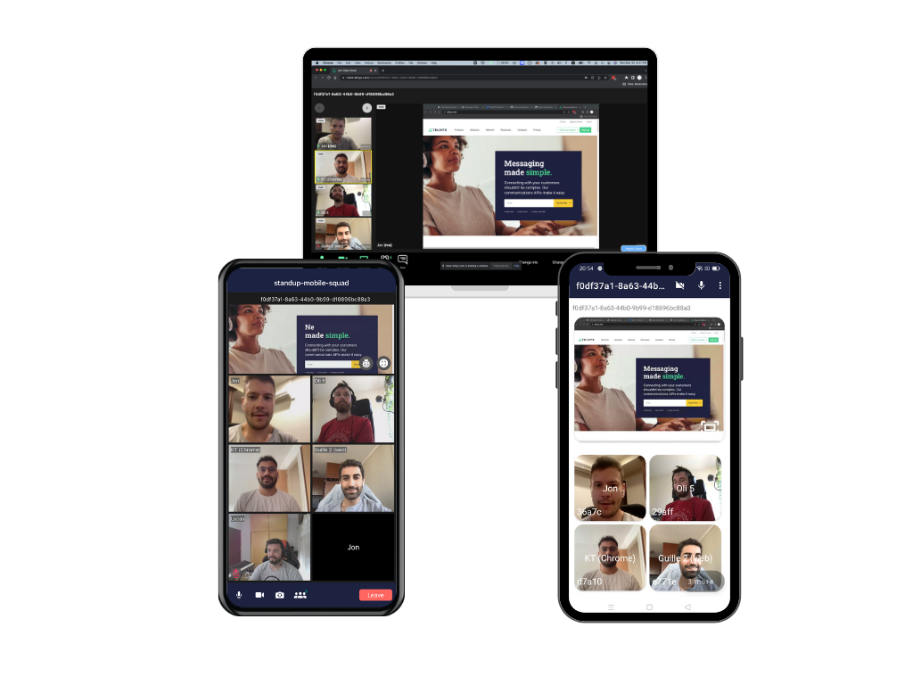

# Telnyx Meet iOS App
This is an example app built with the [Telnyx Video iOS SDK](https://github.com/team-telnyx/telnyx-video-ios). The code is open source and easy to configure so developers can try out real time video an audio features.

### 

## Features
- [x] Real time video conferencing with audio and video
- [x] Enable/disable camera
- [x] Mute/unmute mic
- [x] Toggle front/back camera
- [x] Active speaking detection
- [x] Real time audio/video statistics
- [x] Display remote participant screen with full screen support
- [x] Display list of participants with their real time audio/video status

## Getting Started
You'll need an Telnyx API key and a Room ID which you'll create in the following steps.

### Step 1: Sign Up for a Telnyx Mission Control Portal Account

Head to [telnyx.com/sign-up](https://telnyx.com/sign-up) to sign up for your free Telnyx account.

Once signed up you will have access to Telnyx Portal, where you can set up and manage your API KEY, and more.

### Step 2: Create an API KEY

Go to [API Keys](https://portal.telnyx.com/#/app/api-keys) section and click on `Create API Key` button. It will generate a key for you. Copy and save this key in a safe place and don't share it with anyone it is a sensitive value.

You need this API Key to consume the API `https://api.telnyx.com/v2/rooms` to manage your room ids.

### 

### Step 3: Create a Room ID

You should [read this documentation](https://developers.telnyx.com/docs/api/v2/video/Rooms) to learn how to create a new Room ID. When you get your `roomId` you can join a Room.
